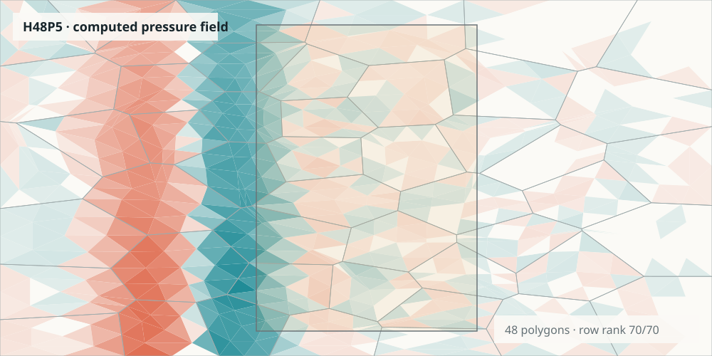

# Polytopal Pseudospectral Port-Hamiltonian Methods in 2D

[](https://github.com/redhamoulla/polytopal-pseudospectral/actions/workflows/ci.yml)
[](https://redhamoulla.github.io/polytopal-pseudospectral/)
[](LICENSE)

A compact research implementation of compatible two-dimensional
pseudospectral discretization on polygonal meshes, power-preserving
port-Hamiltonian assembly, and passive neural closures for nonlinear porous
acoustics.

[](https://redhamoulla.github.io/polytopal-pseudospectral/)

**[Open the interactive wave and energy demonstration](https://redhamoulla.github.io/polytopal-pseudospectral/)**

## What is validated

This release deliberately separates two complementary experiments.

| Evidence | Result | Meaning |
| --- | ---: | --- |
| Corrected H48P5 rollout | 48 polygons, wall rank **70/70 after row equilibration** | Recorded post-confirmatory field shown in the demo |
| Terminal H48P5 energy ledger | **99.99921%** accounted for | Stored + dissipated + reflected + transmitted energy |
| Independent FV 80 x 40, passive SPD closure | **2.2508%** downstream error | Released checkpoint; non-negative dissipative power by construction |
| Independent FV 80 x 40, direct MLP | **9.7724%** downstream error | Same grid and training seed; minimum power is negative |
| Controlled multi-case audit | direct MLP violates passivity in **44/55 evaluated model-case configurations** | This is not a count of divergent rollouts; none of the reported rollouts diverged |

The animated pressure field uses the analytic passive drag law on the
row-equilibrated H48P5 polygonal model. The learned-closure numbers below it
come from a separate, independently implemented finite-volume solver. They
are not presented as one and the same numerical experiment.

## Install and reproduce

Python 3.11 or later is required.

```bash
git clone https://github.com/redhamoulla/polytopal-pseudospectral.git
cd polytopal-pseudospectral
python -m venv .venv
source .venv/bin/activate
python -m pip install --upgrade pip
python -m pip install -e ".[test]"
```

For strict release replication, use Python 3.12.13 and
`python -m pip install -r requirements-reference.txt` before installing the
package in editable mode.

Reproduce the headline finite-volume comparison in a few seconds:

```bash
OPENBLAS_NUM_THREADS=1 OMP_NUM_THREADS=1 MKL_NUM_THREADS=1 \
python examples/reproduce_porous_duct.py --check
```

Run the invariant and end-to-end tests:

```bash
OPENBLAS_NUM_THREADS=1 OMP_NUM_THREADS=1 MKL_NUM_THREADS=1 \
python -m pytest -q
python tools/validate_demo.py --check-only
```

The released checkpoints, precise reference values and their interpretation
are documented in [`examples/assets/MODEL_CARD.md`](examples/assets/MODEL_CARD.md)
and [`reference_metrics.json`](examples/assets/reference_metrics.json).

## Method in one page

On each polygon, the code builds the total-degree polynomial complex

\[
\mathbb P_N\Lambda^0
\xrightarrow{\mathrm d}
\mathbb P_{N-1}\Lambda^1
\xrightarrow{\mathrm d}
\mathbb P_{N-2}\Lambda^2.
\]

Modal bases are orthonormalized with polygonal cubature and converted to a
cardinal representation at approximate Fekete points. Polynomial
differentiation remains exact in both representations. Boundary traces are
compressed into minimal power coordinates, while shared edges are assembled
by a common pressure effort and cancellation of outward fluxes.

The global constraint is eliminated with equilibrated, rank-revealing linear
algebra. The implementation never forms \((G^\mathsf{T}G)^{-1}\): raw normal
equations can be unusable even when the constraint has full rank. The tests
cover nilpotency, discrete Stokes, open-Dirac skew symmetry, interface power
cancellation, spectral convergence and deterministic Voronoi assembly.

For the learned porous closure, the structured model predicts a triangular
factor \(L\) and applies

\[
r(v,x)=L(x,v)L(x,v)^\mathsf{T}v,
\qquad
v^\mathsf{T}r(v,x)\geq 0.
\]

The direct MLP has comparable capacity but no sign constraint. The released
comparison evaluates both models in a staggered finite-volume solver that
does not import the polygonal discretization.

## Repository scope

This is a curated software release, not the experiment directory used during
research. It contains only:

- the tested single-cell and multicell polygonal implementation;
- deterministic Voronoi rank and conditioning diagnostics;
- the NumPy passive and direct neural closures;
- one independent FV reproduction path and two small checkpoints;
- one selected H48P5 observable checkpoint;
- the self-contained GitHub Pages demonstration and its validator;
- tests and continuous integration.

Intermediate campaigns, failed variants, cached simulations, notebooks,
logs, report builders and generated LaTeX artefacts are intentionally absent.

## Scope and limitations

The polynomial exactness statement is algebraic and is not tied to convexity;
the current node-selection and cubature routines do assume convex polygonal
cells. The Voronoi evidence supports practical full-rank assembly after
equilibration, but it is not a uniform inf-sup theorem. Dense local algebra
limits the present implementation to research-scale meshes.

The corrected H48P5 result is a **post-confirmatory diagnostic**. The frozen
high-resolution protocol produced close final-case phase and energy agreement
but did not establish asymptotic h/p convergence. The direct MLP violated
instantaneous passivity but did not diverge in the reported rollouts. The
released neural checkpoints are specific to the documented geometry,
nondimensionalization, feature map and excitation family.

## Citation and prior work

GitHub exposes the software citation stored in [`CITATION.cff`](CITATION.cff).
The geometric program extends:

> R. Moulla, L. Lefèvre and B. Maschke, “Pseudo-spectral methods for the
> spatial symplectic reduction of open systems of conservation laws,”
> *Journal of Computational Physics* 231(4), 1272–1292, 2012.
> [doi:10.1016/j.jcp.2011.10.008](https://doi.org/10.1016/j.jcp.2011.10.008)

A companion manuscript for the polygonal 2D construction is in preparation;
its definitive citation will be added only after the public preprint metadata
are frozen.

## Licences

The Python and JavaScript source is released under the
[BSD 3-Clause License](LICENSE). The released checkpoints, reference metrics,
recorded observables and embedded demonstration data are licensed under
[CC BY 4.0](DATA_LICENSE.md). No publisher-formatted article PDF is included.
